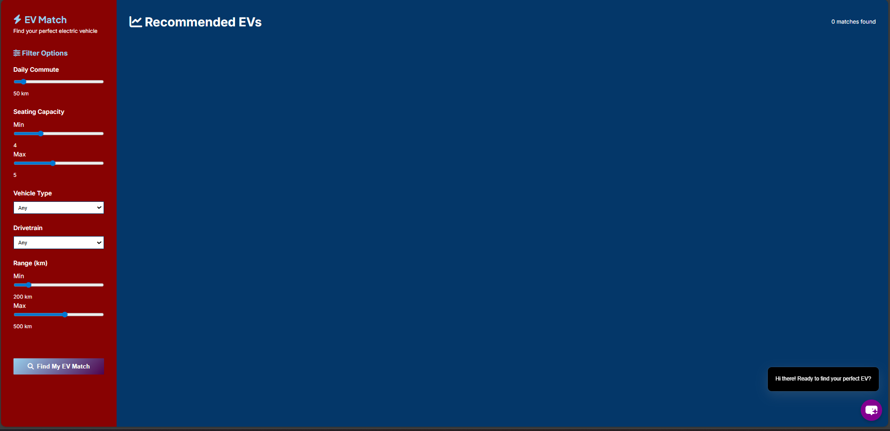
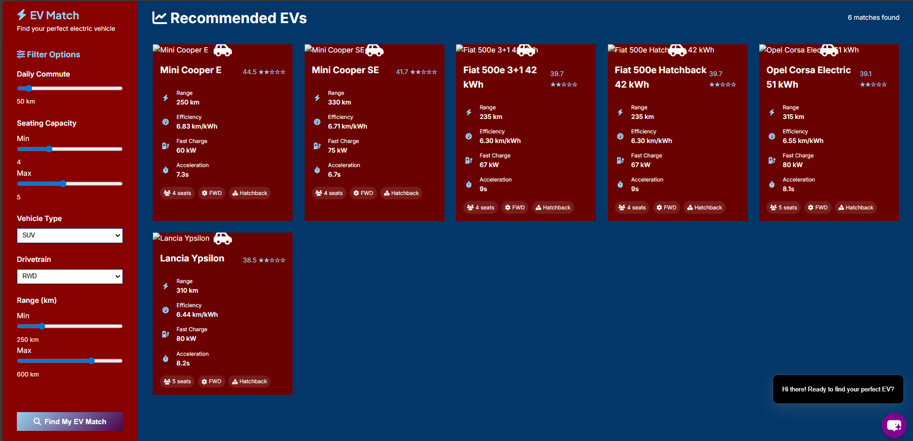

#  Electric Vehicle (EV) Recommendation System

A simple **Flask-based web application** that recommends electric vehicles (EVs) based on user preferences using a **K-Nearest Neighbors (KNN)** model.  
The backend is built with **Python (Flask, Pandas, Scikit-learn)**, and the frontend is designed using **HTML & CSS** for a clean and user-friendly interface.

---

## Features
-  Dynamic EV data loading and cleaning (`ev.csv` dataset)
-  Calculates efficiency and price-per-km for better insights
-  KNN-based recommendation engine for personalized EV suggestions
-  API endpoint (`/api/recommend`) for JSON-based recommendations
-  Simple, responsive frontend built with HTML and CSS

---

## Tech Stack
- **Backend:** Python, Flask
- **ML Model:** Scikit-learn (KNN)
- **Data Processing:** Pandas, NumPy
- **Frontend:** HTML, CSS

---
## Screenshots

###    Home Page


### Recommendation Page


##  Getting Started

###  Clone the Repository
```bash
git clone https://github.com/yourusername/ev-recommendation-system.git
cd ev-recommendation-system
